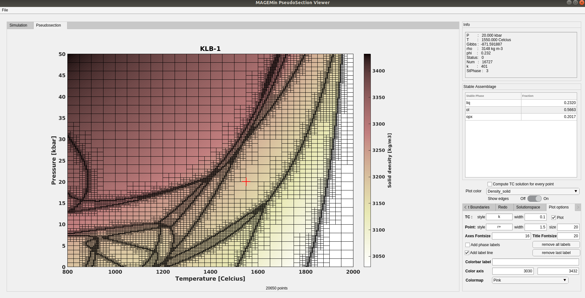

# Mineral Assemblage Gibbs Energy Minimization (MAGEMin)

C routine to compute a stable mineralogical assemblage using Gibbs Free Energy Minimization. We employ a combination of linear programming, partitioning Gibbs free energy and non-linear constrained minimization to solve for phase equilibria at constant pressure, temperature and bulk-rock composition.

## Available dataset
- Igneous thermodynamic database (Holland et al., 2008)
- KNCFMASHTOCr chemical space
- Solution models (biotite, clinopyroxene, cordierite, epidote, fluids, garnet, hornblende, ilmenite, feldspar, liquid, muscovite, olivine, orthopyroxene, plagioclase, spinel)

## Imported libraries
- LAPACKE (C version of LAPACK)
- NLopt (https://nlopt.readthedocs.io/)
- uthash (https://troydhanson.github.io/uthash/)
- ketopt (https://github.com/attractivechaos/klib/blob/master/ketopt.h)

## Usage 

## Installation 

## Contributing
You are very welcome to request new features and point out bugs by opening an issue. You can also help by adding features and creating a pull request.

## Development roadmap

## Funding
Development of this software package was funded by the European Research Council under grant ERC CoG #771143 - [MAGMA](https://magma.uni-mainz.de).
